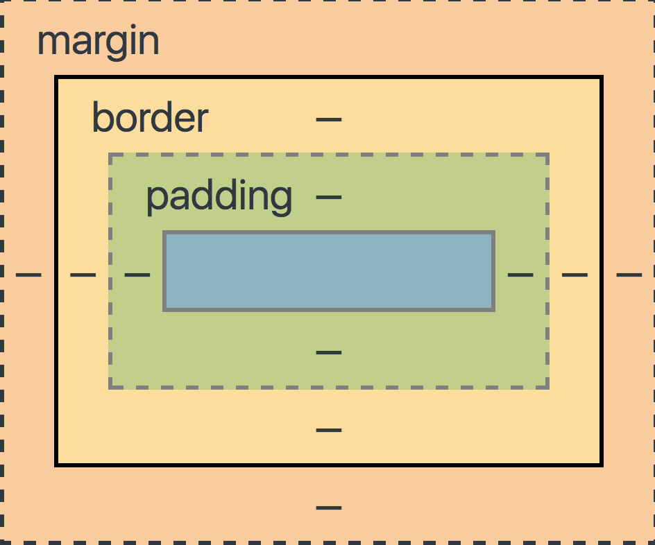

title: css
author:
  name: Koala
  url: https://github.com/KoalaCoders
output: ./css/index.html
theme: IgorMotorny/cleaver-koala
style: style.css
controls: true

--
# css
--
## Inline
```html
<tag style="prop: value; prop: value;"></tag>
```
--
## Internal
```html
<style>
  .selector {
    prop: value;
  }
</style>
```
--
## External
####  Html file

```html
<link rel="stylesheet" href="path/to/file.css" >
```
#### Css file
```css
.selector {
  prop: value;
}
```

--

```css
tag { }

.class { }

#id { }

[attribute="value"] { }

* { }
```

--
## Text
* text-align: <code class="code"> left | center | right | justify </code>
* color: <code class="code">#RRGGBB | rgb(R, G, B) | rgba(R, G, B, A) </code>
* text-transform: <code class="code">uppercase | uppercase | capitalize</code>
* text-decoration: <code class="code">none|underline|overline|line-through</code>
--
## Element positioning
* display: <code class="code">block | inline-block | flex | inline-flex</code>
* float:  <code class="code">left | right | none</code>
* position:  <code class="code">relative | absolute | fixed</code>
* z-index:  <code class="code">value</code>
--

--
## Element styling
* background: <code class="code"> #RRGGBB | url('path')</code>
* background-repeat: <code class="code"> center | value </code>
* background-size: <code class="code">cover | contain | value</code>
--
## Pseudo classes
```css
all:hover { }

input:focus { }

a:visited { }
a:focus { }

li:nth-child() { }
li:first-child { }
li:last-child { }
```
--
## Pseudo elements

```css
.selector:before {
  content: "";
}

.selector:after {
  content: url();
}

```
--
# Animation
--
## Transition
* <code class="code">transition-property</code>
* <code class="code">transition-duration</code>
* <code class="code">transition-timing-function</code>
* <code class="code">transition-delay</code>
--
## @keyframes

```css
@keyframes jump {
    0%   {top: 0px;}
    25%  {top: 200px;}
    50%  {top: 100px;}
    75%  {top: 200px;}
    100% {top: 0px;}
}

@keyframes top {
    from {top: 0px;}
    to {top: 200px;}
}

```
--
```css
.selector {
   animation: name time (number | infinite);
}

```

--
# Layout
--
```css
@media (min-width: value) { }
@media (max-width: value) { }

```
--
## Float
[Tap to open](http://codepen.io/Motorny/pen/ORWErO)
--
## Flex
[Tap to open](http://codepen.io/Motorny/pen/bwgrJY)
--
# CSS PREPROCESSORS
--
## Less
## Sass
## Scss
## Stylus
--
[Tap to open](http://codepen.io/Motorny/pen/dpNKqR)
--
# BEM
--
```css
.block { }
.block__element { }
.block__element--modifier { }
```
