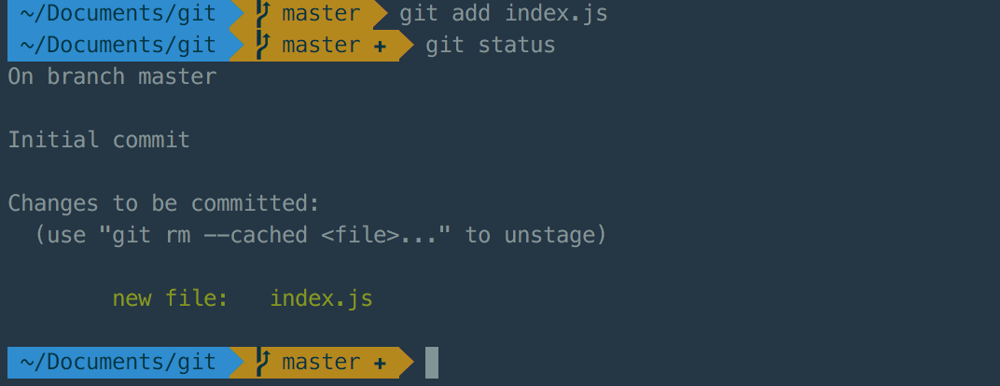

# Git
## Install git
* Linux `$ yum install git-core` or `$ apt-get install git`
* Windows [http://msysgit.github.com/](http://msysgit.github.com/)

## Init project
```git
$ git init
```

Now you at `master` branch.
## Create commit
Add `index.js` file.

### Check changes

```
$ git status
```


### Add file

```
$ git add *filename*
```



Then create `index.html` and `style.css`


And add them all using `git add .`


Commit them
```
$ git commit -m '*Commit message*'
```


## GitHub

Create repository


Then paste in console
```
git remote add origin https://github.com/*username*/Git.git
git push -u origin master
```


Let's check github


### Create pull request

Let's create new branch and change `index.html`


Open github and create pull request


or


then


When your create pull request you should show it for your team. And someone should review it.


Now you could to merge it
