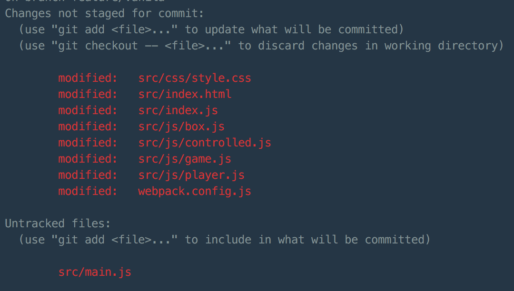

title: Git
author:
  name: Koala
  url: https://github.com/KoalaCoders
output: index.html
style: style.css
theme: sudodoki/reveal-cleaver-theme
controls: true


--
<a class="gitLink image" href="https://git-scm.com/book/en/v2/Getting-Started-Installing-Git">
  
  <small>Tap to open link</small>
</a>
--

### Clone repository
`$ git clone *repository link*`


--

### Get all branches from remote
`$ git fetch`

--

### Create new branch

`$ git checkout -b *branch name*`

--
### Go to exist branch

`$ git checkout *branch name*`

--

## Take a look for modified files

`$ git status`


--
## Add files
`$ git add webpack.config.js`
<br>
<br>
<br>
**or add all files**
<br>
<br>
<br>
`$ git add .`

--

## Commit files
`$ git commit -m '*commit message*'`

--
## Combo!
`$ git commit -a -m '*commit message'`

--
## Push to remote

`$ git push origin *brach*`

--
## Update branch
`$ git pull origin #branch*`
--
## Flow
```
// on master branch
  $ git pull origin master
  $ git checkout -b fix/layout
  $ git commit -a -m 'Fixed footer padding'
  $ git push origin fix/layout
```
