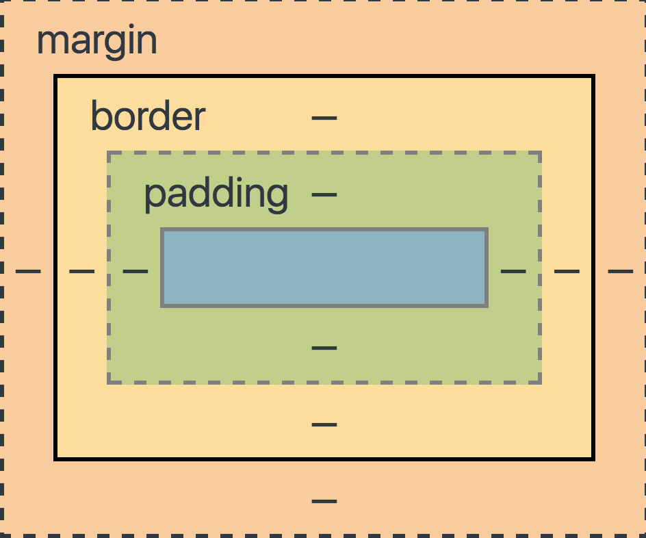

title: html
author:
  name: Koala
  url: https://github.com/KoalaCoders
output: ./html/index.html
theme: IgorMotorny/cleaver-koala
style: style.css
controls: true
--

# Html

--
<div style="font-size: 50px; text-align: center;">
  `<tag>innerHtml</tag>`
</div>
--

```html
<!DOCTYPE html>
<html>
<head>
  <meta charset="UTF-8">
  <title></title>
</head>
<body>

</body>
</html>
```

--
<div class="div">
```
  block
```
</div>

<div class="span">
```
  inline-block
```
</div>
<div class="span">
```
  inline-block
```
</div>
--

--

