title: Introduction
author:
  name: Koala
  url: https://github.com/KoalaCoders
output: ./introduction/index.html
theme: sudodoki/reveal-cleaver-theme
controls: true

--
## JavaScript
### (Front-end)
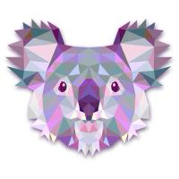

--
### Начинаем разбираться с JS
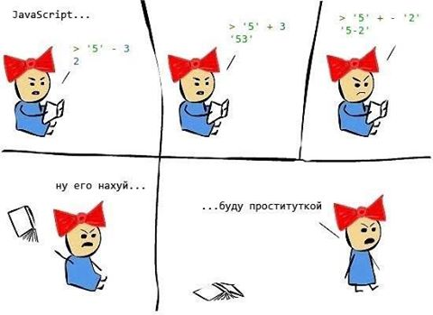

--
### Популярность JavaScript
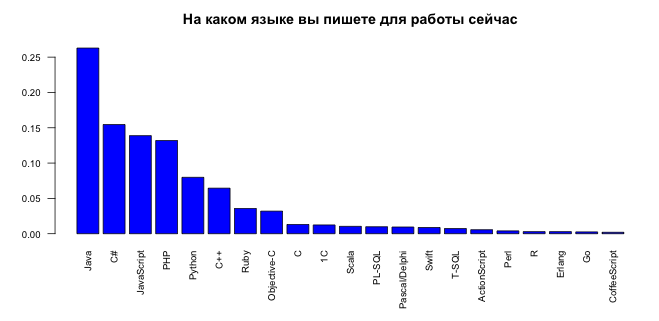

--
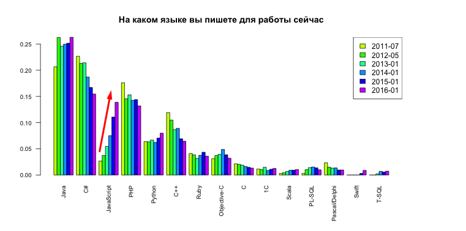

--
jobs.dou.ua

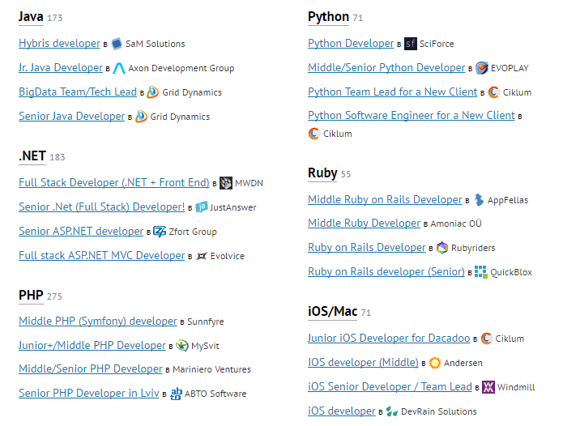

--
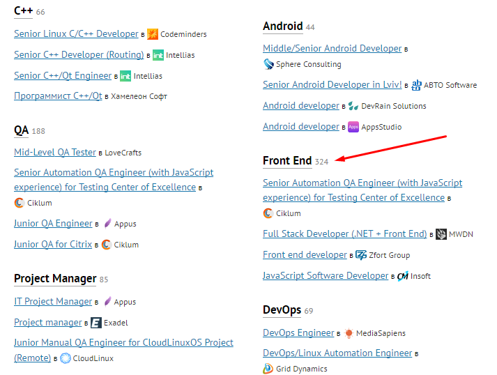

--
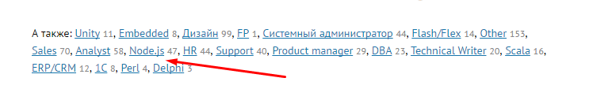

--
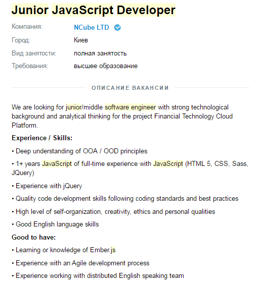

--
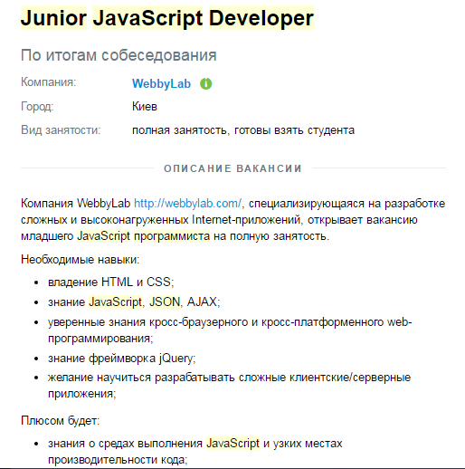

--
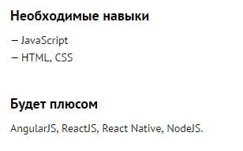

--
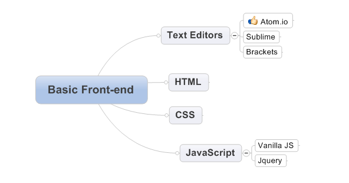

--
## HTML & CSS
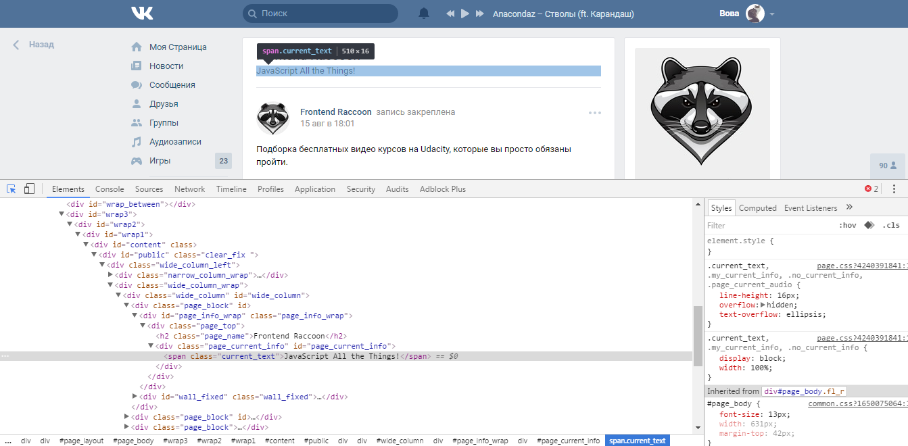

--
## JavaScript

--
## HTTP

--

--
## SPA

--
<a href='https://coggle.it/diagram/Vz9LvW8byvN0I38x'>Link (lol)</a>
